<!-- # RGB RGB SYSTEM CHESSBOARD -->

The **rgb_rgb_system_chessboard** is a robotic system meant to be use in simple tests and to serve as example for ATOM beginners. The novelty here is that the system uses a chessboard as calibration pattern, instead of the usual charuco board.

The system is composed of two rgb cameras mounted on a tripod.
Cameras are called **rgb_left** (red) and **rgb_right** (green).
The system contains the following topics:

  - /rgb_left/camera_info
  - /rgb_left/image_raw
  - /rgb_right/camera_info
  - /rgb_right/image_raw
  - /tf
  - /tf_static

Since this is a systems to test calibration, where frame rate is not a critical issue, we restrained images topics to 10Hz.
This is a simulated system, which can be seen in gazebo:

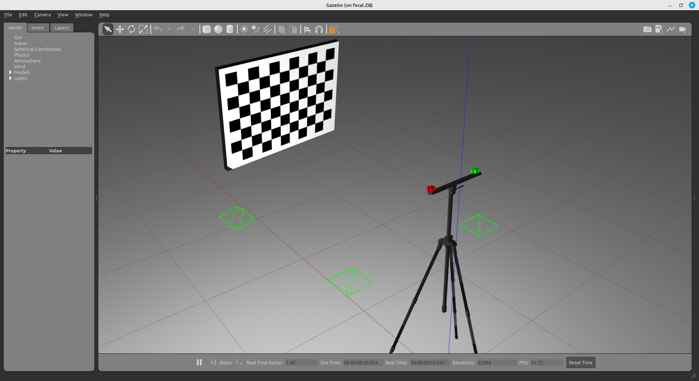

... and in rviz:

# How to run

First launch the gazebo simulation:

    roslaunch rgb_rgb_system_chessboard_gazebo gazebo.launch

Then you can bringup the system:

    roslaunch rgb_rgb_system_chessboard_bringup bringup.launch

You can record a bag file using:

    roslaunch rgb_rgb_system_chessboard_bringup record.launch

This will put the bag file into your $ROS_BAGS folder.

# Calibration

The calibration of any robotic system using **ATOM** may have several variants. We recommend a careful reading of the [documentation](https://lardemua.github.io/atom_documentation/) to learn all the details.

In this section, out goal is to carry out the simplest possible calibration pipeline for the **rgb_rgb_system_chessboard**.

To calibrate, we will need a bagfile called [train.bag](https://drive.google.com/file/d/1zucjVjg27plyvN-vWpAyo3-utY7Xro--/view?usp=sharing), which contains a recording of the system's data when viewing a calibration pattern in several positions.
We produced the bagfile by bringing up the system and then recording a bagfile as described above.
This is a small bagfile with 50 seconds / 55MB for demonstration purposes. Typically, calibration bagfiles are larger.

Download the bagfile and put it in **$ROS_BAGS/rgb_rgb_system_chessboard**.

Next we describe each of the steps in the calibration pipeline.

## Creating a calibration package

See also the [generic documentation](https://lardemua.github.io/atom_documentation/procedures/#create-a-calibration-package) on this topic.

Using ATOM conventions, we define name of the calibration package as **rgb_rgb_system_chessboard_calibration**, and create it using:

    rosrun atom_calibration create_calibration_pkg --name rgb_rgb_system_chessboard_calibration

**NOTE**: This procedure is carried out only once, and was done already. As such, this ros package is already [included in the atom repo](https://github.com/lardemua/atom/tree/noetic-devel/atom_examples/rgb_rgb_system_chessboard/rgb_rgb_system_chessboard_calibration). Therefore, you **should not execute this instruction** for the rgb_rgb_system_chessboard.

## Configuring the calibration

This is the [config.yml](https://github.com/lardemua/atom/blob/noetic-devel/atom_examples/rgb_rgb_system_chessboard/rgb_rgb_system_chessboard_calibration/calibration/config.yml) that we wrote to define the calibration. There are two sensors to be calibrated, named **rgb_left** and **rgb_right**. The pattern is a **chessboard marker**.
The configuration file points to the bagfile mentioned above, and the _anchored_sensor_ is defined as the **rgb_left** sensor.

To configure run:

    rosrun rgb_rgb_system_chessboard_calibration configure

Which will run a series of checks and produce several files inside the **rgb_rgb_system_chessboard_calibration** package.

## Collecting a dataset

To collect a dataset we run:

    roslaunch rgb_rgb_system_chessboard_calibration collect_data.launch output_folder:=$ATOM_DATASETS/rgb_rgb_system_chessboard/dataset1 overwrite:=true

And save a few collections.

We will use as example the [train](https://drive.google.com/file/d/1FOd4HHPMB0Yn7lCSDMu2wveZW3I-k6QM/view?usp=sharing) dataset, which contains 6 collections, as shown bellow.

Download and decompress the dataset to **$ATOM_DATASETS/rgb_rgb_system_chessboard/train**.

Collection |           rgb_left             |           rgb_right
:----------------:|:-------------------------:|:-------------------------:
0 | 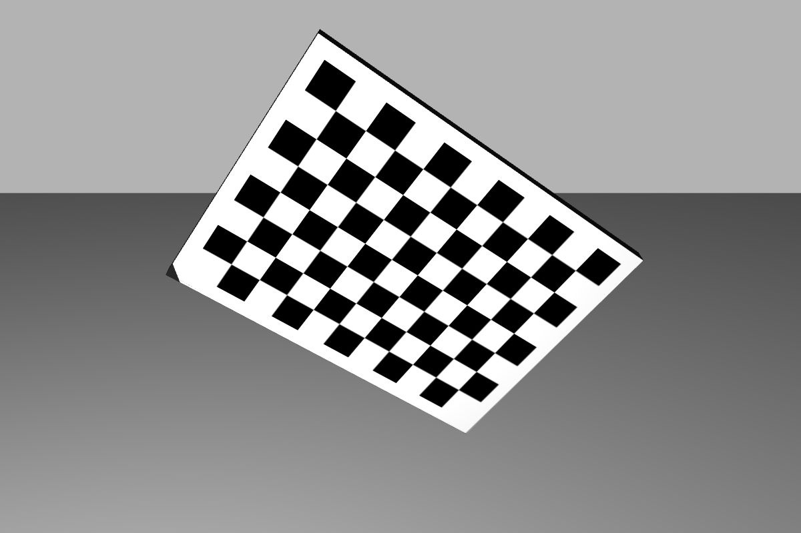 |  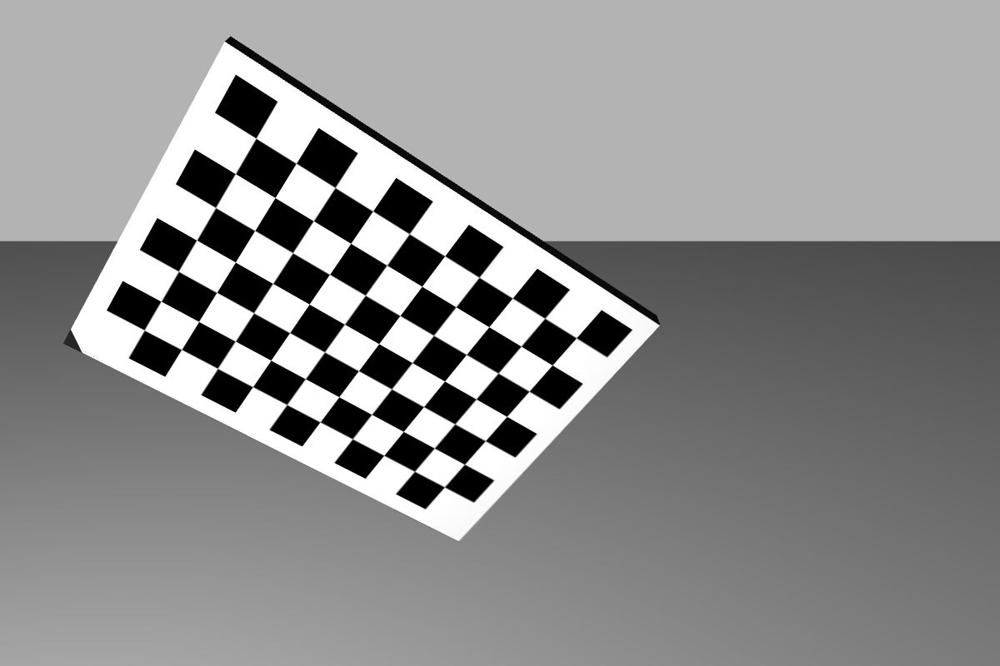
1 | 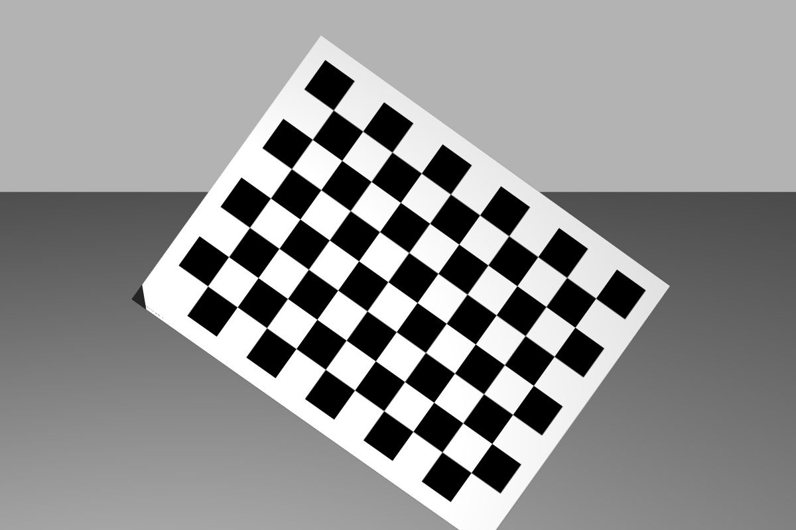 |  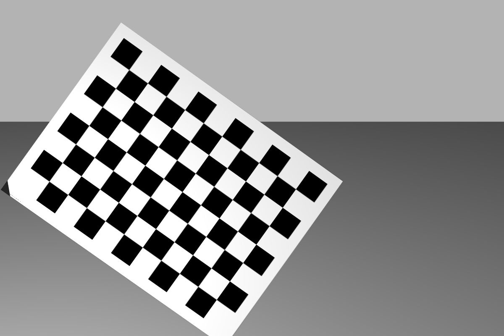
2 | 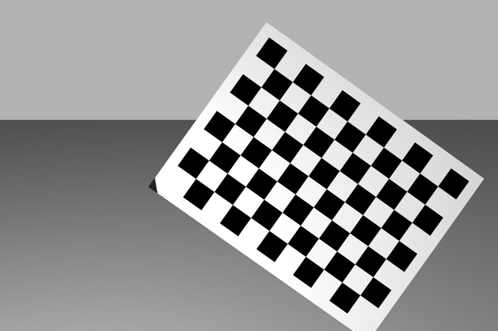 |  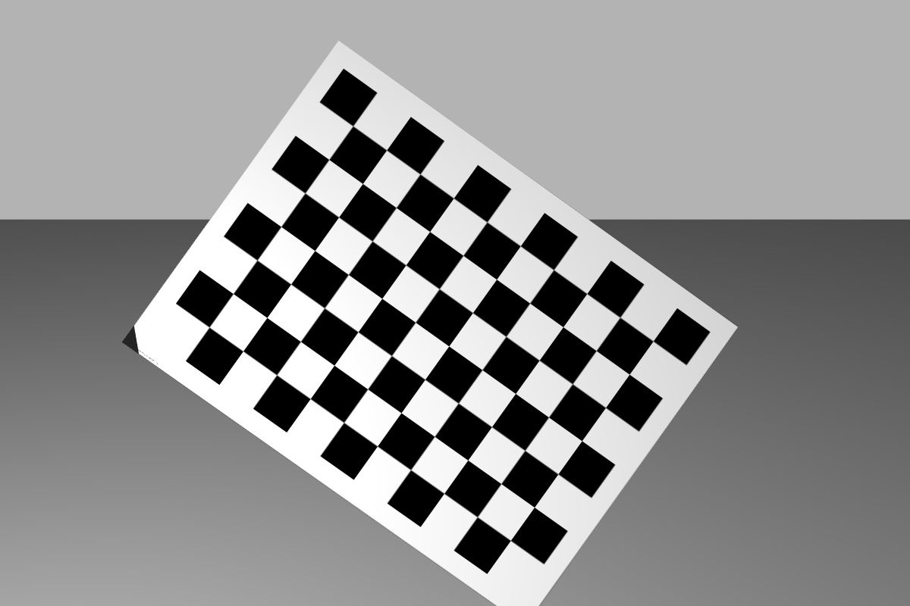
3 | 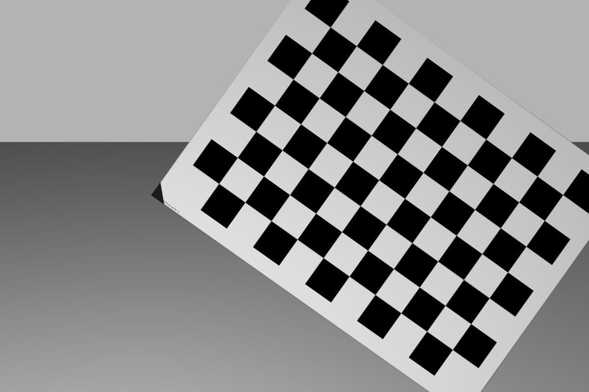 |  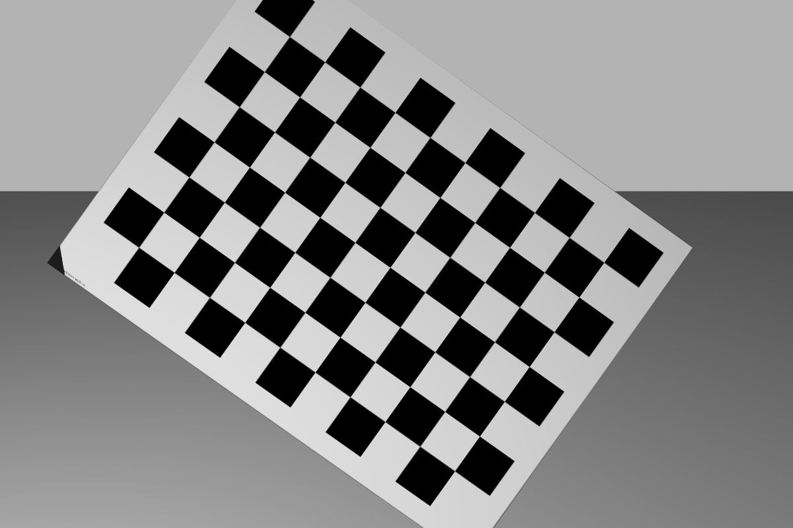
4 | 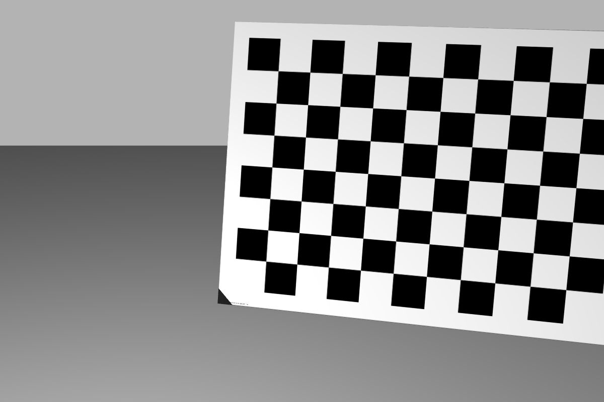 |  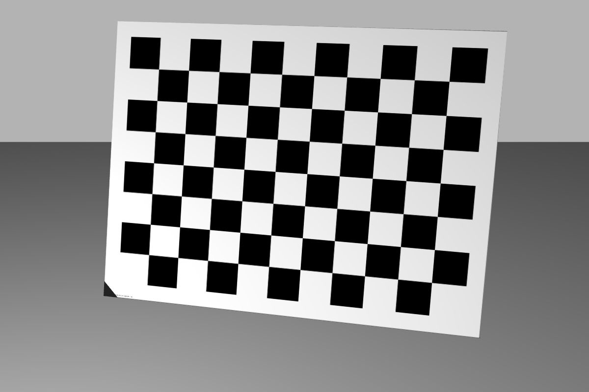
5 | 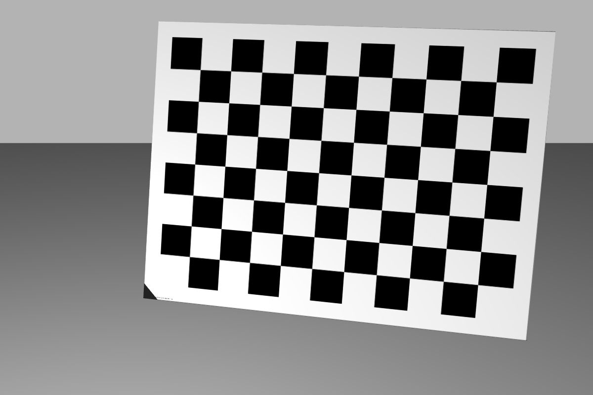 |  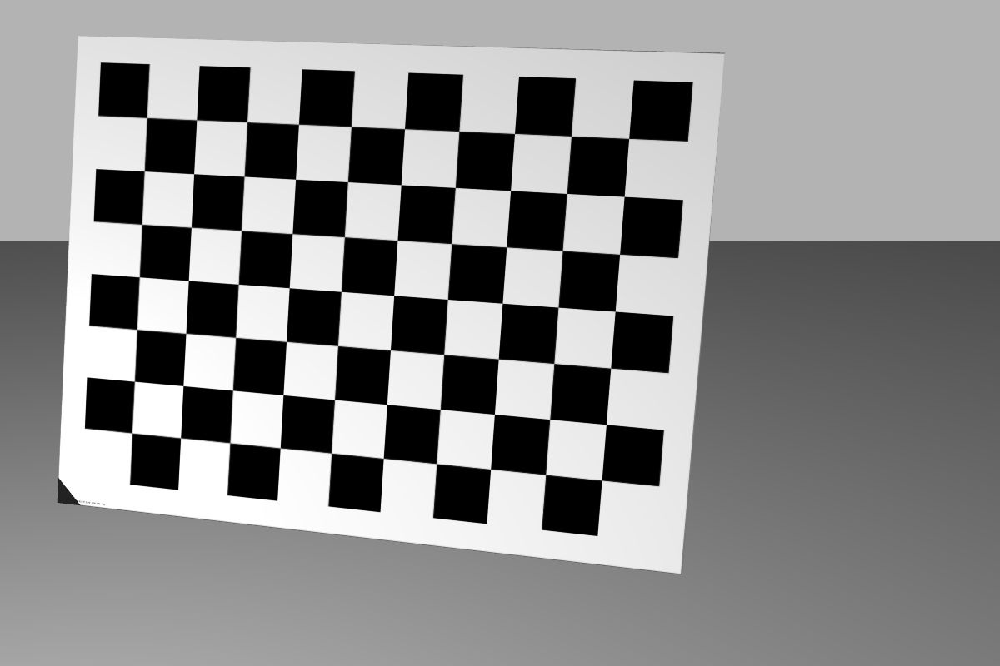

## Running the Calibration

To calibrate, first setup visualization with:

    roslaunch rgb_rgb_system_chessboard_calibration calibrate.launch

Then carry out the actual calibration using, using a **nig** to give some noise in the initial estimate:

    rosrun atom_calibration calibrate -json $ATOM_DATASETS/rgb_rgb_system_chessboard/train/dataset.json -v -rv -si -nig 0.1 0.1

At the beginning of the calibration, the error table is this:

where we can see that the errors for the **rgb_right** camera are very high due to the noise that was induced in the initial estimate. The initial state of the system is the following:

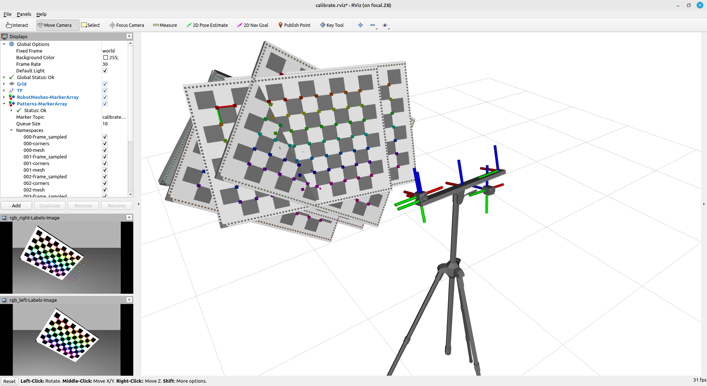

where it is possible to see that the **rgb_right** camera is below the support bar of the tripod, i.e., not in the correct position.

After the optimization finishes we get:

Here we can see that as a result of the calibration, the errors are much lower.
This is also observed visually:

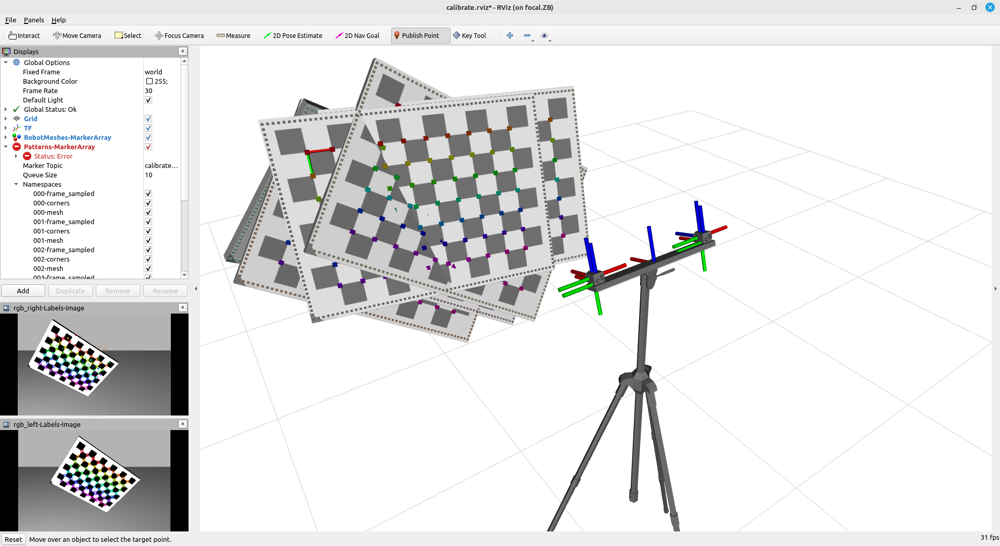

since the position of the **rgb_right** is now on top of the support bar.

## Evaluation

The evaluation be conducted with a second dataset which has not been seen during calibration. We call these the test datasets.

Download the [test](https://drive.google.com/file/d/1bvHr2iXsNS3snF9Af8gJ0mJJbPwUcTpJ/view?usp=sharing) dataset and decompress to **$ATOM_DATASETS/rgb_rgb_system_chessboard/test**.
Then run:

    roslaunch rgb_rgb_system_chessboard_calibration full_evaluation.launch test_json:=$ATOM_DATASETS/rgb_rgb_system_chessboard/test/dataset.json train_json:=$ATOM_DATASETS/rgb_rgb_system_chessboard/train/atom_calibration.json

which will produce a table comparing the estimated pose versus the ground truth pose, which is only possible to compute because we are using a simulated system:

which are very small, meaning the calibration is very accurate.

It is also possible to see a table comparing the sensor to sensor projections. This is interesting since it is possible to have also with real data:

Also in this evaluation, the errors are very low, which means the calibration is very accurate.